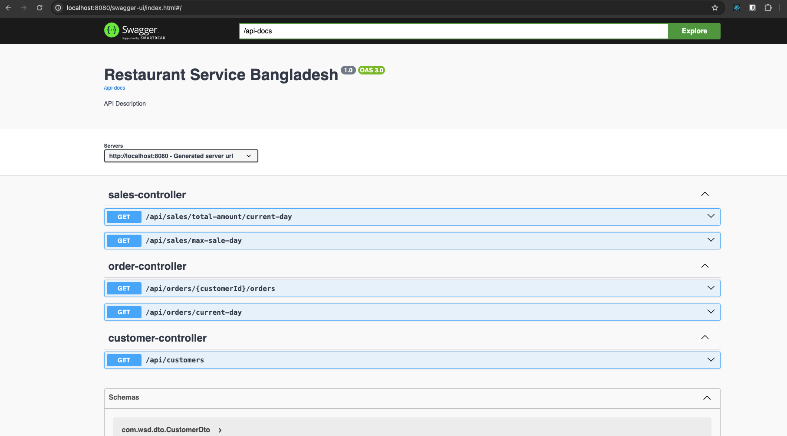

SpringBoot + Flyway + Postgres + Docker
================================================
Example how to combine SpringBoot with Flyway and Postgres DB using Docker.

Goals
-----
- Develop a simple Spring Boot application with database
- Easy manage database schema using Flyway
- Simple usage of Postgres database run as a Docker container
- Use Docker-Compose to bind Spring Boot application with Postgres database 

Requirements
------------
- [Docker](https://docs.docker.com/install/)
- [Docker Compose](https://docs.docker.com/compose/install/)

Docker Compose usage
--------------------
1. Go to `docker` location
2. Run Bash script to build Docker-Compose images: `./build-docker.sh`
3. Go to `docker/app` location (where `docker-compose.yml` is located)
4. Run Docker-Compose command to create and start application and database: `docker-compose up -d`
5. Run Docker-Compose command to stop and destory application and database: `docker-compose down`

##### Docker Compose commands:
- `docker-compose up` - create and start Docker containers
- `docker-compose up -d` - create and start Docker cotainers in the background
- `docker-compose down` - stop and destroy Docker cotainers
- `docker-compose start` - start Docker containers
- `docker-compose stop` - stop Docker containers
- `docker-compose logs -f` - tailing logs of Docker cotainers
- `docker-compose ps` - check status of Docker cotainers 

Test API: `curl -X 'GET' \ 'http://localhost:8080/api/customers' \ -H 'accept: application/json'`

##### Persistence
For PostgreSQL to preserve its state across container destroy and create, Docker mount a volume located in `docker/storage` (defined in a Dockerfile)

#### exposed API call via curl

## API to return the total sale amount of the current day.

` curl -X 'GET' \ 'http://localhost:8080/api/sales/total-amount/current-day' \ -H 'accept: application/json' `

## API to return the order list of the current day.

` curl -X 'GET' \ 'http://localhost:8080/api/orders/current-day' \ -H 'accept: application/json' `

## API to return all of the registered customer list.

`curl -X 'GET' \ 'http://localhost:8080/api/customers' \ -H 'accept: application/json'`

## API to return the entire order list of a customer.

` curl -X 'GET' \ 'http://localhost:8080/api/orders/1/orders' \ -H 'accept: application/json' `

##API to return the max sale day of a certain time range.

` curl -X 'GET' \ 'http://localhost:8080/api/sales/max-sale-day?startDate=2024-01-30&endDate=2024-01-31' \ -H 'accept: application/json' `

# Swagger API Docs

When you run our application, specification will be generated. You can check it here:

`http://localhost:8080/swagger-ui/index.html`

